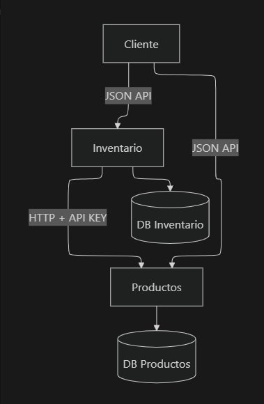

# microservices_product_management

## Arquitectura

- Arquitectura de microservicios
- Servicios independientes:
    - Products Service
    - Inventory Service

## Arquitectura del sistema



### Descripción

- Los microservicios son independientes.
- Cada servicio tiene su propia base de datos.
- La comunicación se realiza vía HTTP usando JSON API.
- Los servicios están containerizados con Docker.


## Comunicación
- HTTP (JSON API)
- OpenFeign
- Autenticación mediante API Key
- Timeouts y reintentos básicos

## Requisitos:
- Docker y Docker Compose instalados
- PostgreSQL (contenedor Docker incluido, eclipse-temurin 17-jdk-alpine)
- Maven instalado (para compilación local)
- Java 17 o superior instalado (para compilación local)
- Puerto 8080 libre (Products Service)
- Puerto 8081 libre (Inventory Service)
- Puerto 5432 libre (PostgreSQL)


## Ejecución

📦 Guía de instalación – Microservicios Spring Boot

Esta documentación describe paso a paso cómo instalar, compilar y ejecutar el proyecto de microservicios desarrollado con Spring Boot, Maven, Docker y PostgreSQL.

🧱 Arquitectura del proyecto

El proyecto está compuesto por:

microservices-parent (POM padre – Maven multi-módulo)

products-service (Microservicio de productos)

inventory-service (Microservicio de inventario)

PostgreSQL (Base de datos en contenedor Docker)

Cada microservicio:

Es una aplicación Spring Boot independiente

Tiene su propia base de datos

Se comunica vía HTTP

Se ejecuta en su propio contenedor Docker.

- Clonar el repositorio

```bash
git clone https://github.com/Godie84/microservices_product_management.git

cd microservices_product_management
```
Abra el proyecto en tu IDE favorito (IntelliJ, Eclipse, VSCode, etc.)
- En la raíz del proyecto, compilar los microservicios usando Maven:

```bash
mvn clean install
```
- Construir las imágenes Docker y levantar los contenedores usando Docker Compose:
```bash
docker-compose up --build
```
- Verificar que los servicios estén corriendo:
- Products Service: http://localhost:8080/swagger-ui/index.html
- Inventory Service: http://localhost:8081/swagger-ui/index.html
- Probar la comunicación entre microservicios usando herramientas como Postman o usar la documentacion de Swagger UI para interactuar con las APIs.

## Documentación API
- Products Service: http://localhost:8080/swagger-ui/index.html
- Inventory Service: http://localhost:8081/swagger-ui/index.html

## Configuración del POM padre

El proyecto usa un Maven multi-módulo.
Archivo: microservices_product_management/pom.xml

- Packaging: pom
- Define versiones comunes
- Gestiona dependencias (Spring Boot + Spring Cloud)

Declara los módulos:

```bash
<modules>
<module>microservices_inventory</module>
<module>microservices_products</module>
</modules>

```

```bash
<parent>
<groupId>com.service</groupId>
<artifactId>microservices-parent</artifactId>
<version>1.0.0</version>
<relativePath>../pom.xml</relativePath>
</parent>

```

## Base de datos (PostgreSQL)

La base de datos se ejecuta en un contenedor Docker.
Archivo: db/init.sql

Este script se ejecuta automáticamente al iniciar PostgreSQL y crea:
- productsdb
- inventorydb

Docker monta este archivo en:
```bash
/docker-entrypoint-initdb.d/init.sql
```
### Justificación:

Se eligió PostgreSQL por ser una base de datos relacional robusta, ampliamente utilizada en entornos empresariales y adecuada para manejar relaciones simples entre entidades como productos e inventario.


## Docker Compose

Archivo: docker-compose.yml

Servicios definidos:

- postgres
- products-service
- inventory-service

Los microservicios:

- Esperan a que PostgreSQL esté disponible.
- Se comunican usando el nombre del servicio (products-service).

Ejemplo de variable de entorno:
```bash
SPRING_DATASOURCE_URL: jdbc:postgresql://postgres:5432/productsdb
```

## Compilación del proyecto

Desde la raíz del proyecto:
```bash
mvn clean package
```

Este comando:

- Compila todos los módulos
_ Genera los JARs en:
```bash
microservices_products/target/
microservices_inventory/target/
```

Ejemplo:
```bash
inventory-1.0.0.jar
products-1.0.0.jar
```

## Ejecución con Docker

Desde la raíz del proyecto:

```bash
docker-compose down
docker-compose up --build
```

Esto:

- Construye las imágenes.
- Levanta PostgreSQL.
- Inicia ambos microservicios.


## Puertos y accesos
Servicio	Puerto	URL
Products	8080	http://localhost:8080
Inventory	8081	http://localhost:8081
PostgreSQL	5432	localhost:5432

Swagger:
- Products Service: http://localhost:8080/swagger-ui/index.html
- Inventory Service: http://localhost:8081/swagger-ui/index.html


## Verificación

- Ambos contenedores deben estar en estado Up.
- PostgreSQL debe iniciar antes que los servicios.
- Inventory debe poder consumir Products.

Ver logs:
```bash
docker-compose logs -f
🛑 Detener el entorno
docker-compose down
```

Para eliminar también los volúmenes:
```bash
docker-compose down -v
```

## Decisiones técnicas destacadas

- Maven multi-módulo para mantener consistencia.
- Docker Compose para facilitar despliegue.
- Bases de datos separadas por microservicio.
- Variables de entorno para configuración.
- Comunicación por nombre de servicio Docker.


## Tiempo de espera

Se implementaron timeouts y reintentos básicos en la comunicación entre microservicios para evitar bloqueos indefinidos y mejorar la tolerancia a fallos temporales.


El microservicio de Inventario configura un tiempo máximo de espera y realiza un número limitado de reintentos antes de retornar un error controlado al cliente.


## Estructura final con Docker
```bash
microservicios-tienda/
│
├── productos-service/
│   ├── Dockerfile
│   ├── pom.xml
│   └── target/app.jar
│
├── inventario-service/
│   ├── Dockerfile
│   ├── pom.xml
│   └── target/app.jar
│
├── docker-compose.yml
└── README.md
```
